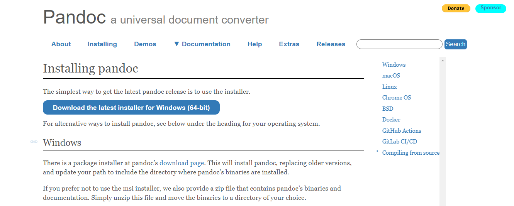
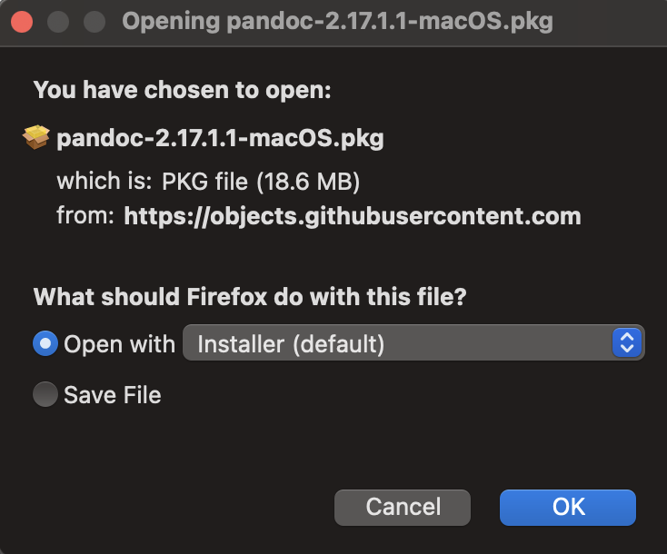

# Downloading

----

## Getting the right version for your operating system

The version of the Pandoc software you need to install will vary depending on the operating system of the computer you are currently using. Find your operating system listed below for the appropriate download instructions. 

**Warning: if you download a version of Pandoc that is not for your operating system, it will not install**

## Windows:
1\. Open your browser

2\. Navigate to [pandoc.org](https://pandoc.org)

3\. Click the "Installing" tab as shown:

 <figure>
 
 <figcaption>Figure 1: This is where to locate the installation tab  on the webpage</figcaption>
 </figure>

4\. Select the latest Windows installer as shown:

 <figure>
 
 <figcaption>Figure 2: This is the installer download button for windows</figcaption>
 </figure>

5\. If you see the installer file downloading, you have successfully downloaded Pandoc!

## Mac OS:
1\. Open your browser

2\. Navigate to [pandoc.org](https://pandoc.org)

3\. Click the "Installing" tab as shown:

 <figure>
 
 <figcaption>Figure 1: This is where to locate the installation tab on the webpage</figcaption>
 </figure>

4\. Select the latest Mac OS installer as shown:

 <figure>
 
 <figcaption>Figure 2: This is where you can locate the Mac installer download button</figcaption>
 </figure>

5\. If you see the following popup, you have successfully downloaded Pandoc! 

 <figure>
 
 <figcaption>Figure 3: This is what your Pandoc installer popup should look like</figcaption>
 </figure>

