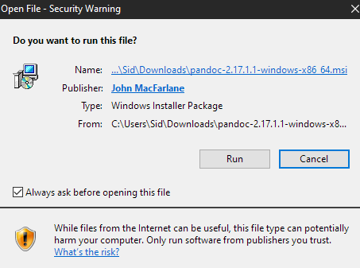
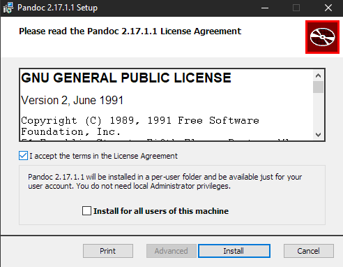
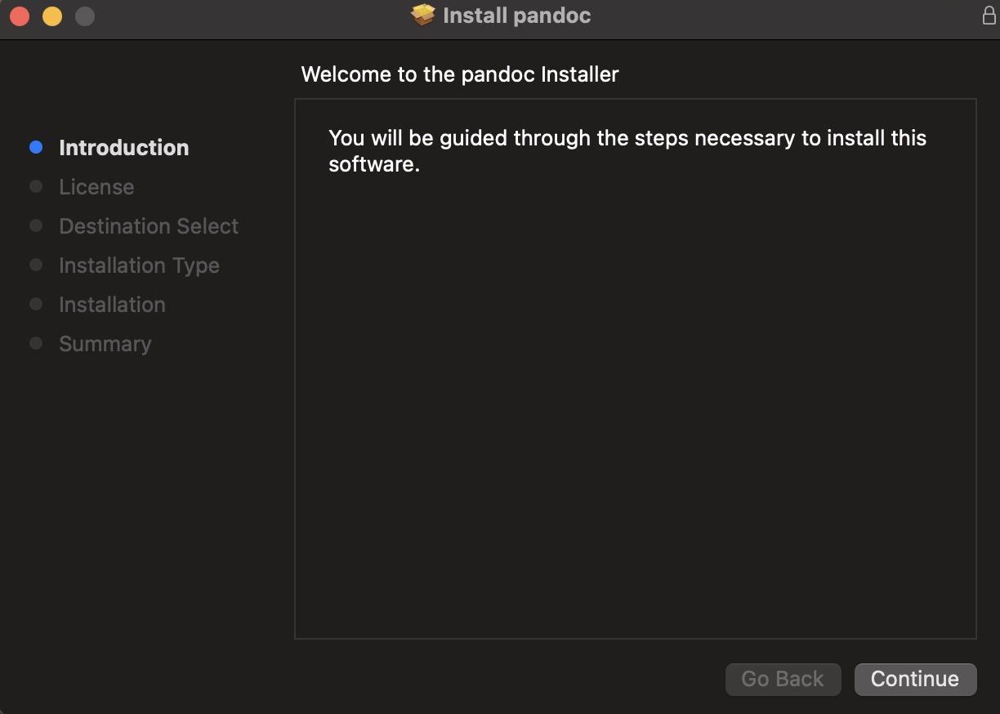

# Installation

---

Similarly to downloading Pandoc, installing it is different depending on the operating system you are using. 

**Warning: Trying to use another operating systems install instructions will result in the installation failing.**

## Windows: 
1. Locate the downloaded file
	*the file will have a .msi extension*

2. Run the installer

3. Click "Run" in the security window as shown:

<figure>

<figcaption>Figure 1: Your sandwich should look like this</figcaption>
</figure>

4. Select the terms and agreements as shown:

<figure>

<figcaption>Figure 1: Your sandwich should look like this</figcaption>
</figure>

5. Finally, select install

When the installer closes automatically, you will know Pandoc has successfully installed!

## Mac:

1. In the installation popup, click the "OK" button as shown:

<figure>

<figcaption>Figure 1: Your sandwich should look like this</figcaption>
</figure>

2. Click the "Continue" button for the remaining installation prompts, as seen below:

<figure>

<figcaption>Figure 1: Your sandwich should look like this</figcaption>
</figure>

Once the installer prompts you to move itself to the trash, the installation is complete!


