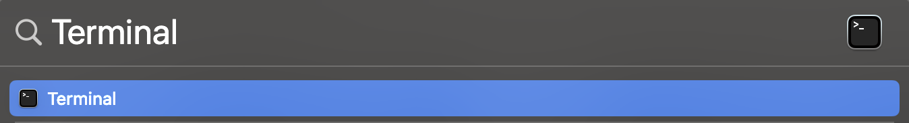

# Converting From Word To Markdown

To convert from Word to Markdown you will also need to open up the terminal or command prompt depending on your operating system. 

## Terminal/Command Prompt Instructions:

### Windows

1. Press and hold the windows key on your keyboard
	*This will be on the bottom left corner and will have the windows logo on it*

2. While the key is pressed, hit the "R" key

3. In the "Run" window that pops up, type "cmd"

4. Press Enter

### Mac

1. Press the command (⌘) key and the spacebar at the same time

2. Type "terminal" into the search bar

3. Select the following icon in the menu: 

	<figure>
	
	<figcaption>Figure 1: This is the icon you should select to access the terminal</figcaption>
	</figure>

## Conversion Instructions

1. Move the Word file you want to convert onto your desktop

2. In the terminal or command prompt type

	> cd Desktop

3. Then copy and paste the following command into the window:
	> pandoc -s input.docx -t
	markdown --extract-media=images -o
	output.md

4. Modify the "input.docx" to match the name of your Word file on your desktop

5. Optionally, you may change the name of output.md to change the name of the output file before it is made

6. Once you press enter, the outputted .md file will be generated and saved to your desktop

**Warning: Pandoc is not perfect. It will create potential formatting issues in your conversion from word to markdown. The only way to fix these is to edit your markdown file manually after it has been created. Remove any incorrectly placed markdown tags until the document is formatted to your liking** 

